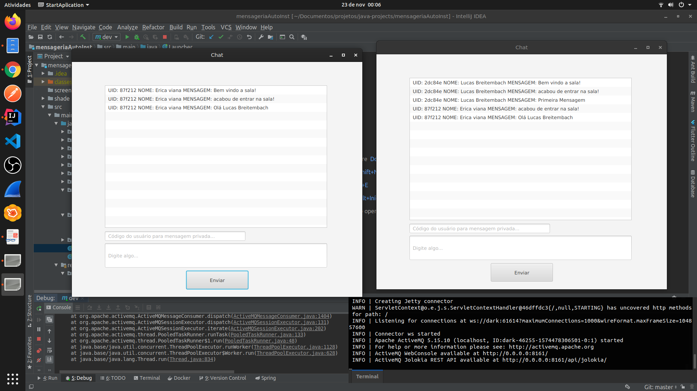

## mensageriaActiveMQ

Sistema de Mensageria queues/Topic Java utilizando activeMQ

Arquitetura MAVEN

Authors: Lucas Breitembach & Erica Viana

#### Dependências

* JAVAFX 13

* JAVA 13 ou pode funcionar também >= 11

* ActiveMQ

#### Maven

```clean javafx:run -U```

#### Linux 

Rodar o projeto:

``` mvn clean javafx:run ```

para criar o jar:

``` mvn compile package ```

``` java -jar shade/mensageriaAutoInst.jar ```


#### Windows

Rodar o projeto:

``` mvn compile exec:java ```

para criar o jar:

``` mvn compile package ```

``` java -jar shade/mensageriaAutoInst.jar ```

Sem conexão com ActiveMQ


entrando no chat


entrando com segundo usuário


enviando mengem chat


enviando mengem privada por UID


Saindo chat

